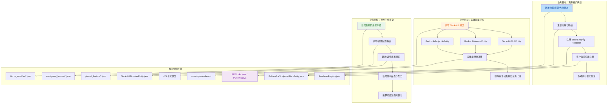

## 1. 高层概览（TL;DR）

- **影响范围**：🔴 **高** - 517 个文件变更，新增 20,480 行 / 删除 6,041 行，涉及资源资产、方块物品、实体基类、世界生成配置的综合性大更新
- **核心变更**：
  - 🎨 大规模资源资产更新：新增大量方块/物品纹理、模型 JSON、方块状态与展示配置
  - 🗑️ 清理过时资源：删除旧纹理、旧模型、旧世界生成配置与旧生物群系
  - 🛡️ 新增 5 套完整盔甲系统（铜 / 染梦 / 秦 / 幽匿 / 钛）
  - 🧸 新增装饰性展示方块与对应物品（金狐雕塑、Qym 玩偶、Uuz 玩偶）
  - 🦎 实体基类重构：引入 `GeckoLibMobEntity` / `GeckoLibMonsterEntity` / `GeckoLibProjectileEntity`
  - 🌍 补全世界生成配置：生物群系修饰器、配置特征、放置特征、战利品表与配方

---

## 2. 可视化概览（代码与逻辑映射）

---

## 3. 详细变更分析

### 🎨 3.1 资源资产大更新（核心内容）

#### 新增方块纹理与模型

| 类别 | 新增/更新内容 |
|------|--------------|
| **玻璃类** | `clarity_glass`、`carve_clarity_glass`、`frame_clarity_glass` 及对应玻璃板 |
| **装饰方块** | `big_bubble`、`congeal_wind_block`、`cyan_moss_stone`、`cyan_stone`、`salt_block`、`white_sand`、`starcall_block`、`starcall_crack`、`windrunner_crystal_block` |
| **展示方块** | `golden_fox_sculpture`、`qin_doll_0`、`little_purple_doll_0`（带 GeckoLib 模型/动画） |
| **地下城风格** | 更新 `shadow_dungeon_block_*`、`shadow_fissure_*`、`shadowshelf_*` 等模型，新增内层/顶层变体模型 |
| **纹理命名规范化** | 将拼音/中文式纹理名批量重命名为英文 snake_case（如 `lie_xi_fang_kuai_0` → `fissure_block_0`） |

#### 新增物品纹理与模型

| 类别 | 新增/更新内容 |
|------|--------------|
| **盔甲套装** | 铜甲、染梦甲、秦甲、幽匿甲、钛甲（含头盔/胸甲/护腿/靴子 + 盔甲层纹理） |
| **工具系列** | `dyedream_axe/hoe/shovel`、`meltdream_axe/hoe/shovel`、`moltengold_axe/hoe/shovel`、`shadow_erosion_axe/hoe/shovel` |
| **纪念物** | `memento_item_02` ~ `memento_item_10` |
| **调试法杖** | 新增 11 把用于世界生成调试的法杖 |
| **Curios 饰品** | 更新并规范化多个饰品纹理名（如 `cross_necklace`、`evasion_cloak`、`turnback_cloak` 等） |

#### 删除的旧资源

- `boboji_curio.json` 模型
- `boboji_buff.png` 药水效果纹理
- 部分旧版 `mineable` 标签文件
- 旧的地下城/水晶洞穴结构模板与模板池

---

### 🧸 3.2 新增装饰性方块与展示物品

#### 组件概览

| 组件 | 文件 | 职责 |
|------|------|------|
| **金狐雕塑方块** | `GoldenFoxSculptureBlock.java` | 装饰性方块，带 BlockEntity |
| **Qym 玩偶方块** | `QymDoll0Block.java` | 装饰性展示方块 |
| **Uuz 玩偶方块** | `UuzDoll0Block.java` | 装饰性展示方块 |
| **方块实体** | `GoldenFoxSculptureBlockEntity.java` 等 | 存储渲染状态 |
| **方块渲染器** | `GoldenFoxSculptureBlockRenderer.java` 等 | GeckoLib 模型渲染 |
| **物品渲染器** | `GoldenFoxSculptureDisplayItemRenderer.java` 等 | 手持/物品栏展示渲染 |

> 这些展示方块采用 **GeckoLib 动画模型**，资源路径遵循 `geo/block/`、`animations/block/`、`textures/block/` 规范。

---

### 🛡️ 3.3 新增盔甲系统

新增 5 套完整盔甲，均注册于 `PDArmorMaterials.java`：

| 盔甲套装 | 对应 Item 类 | 盔甲层纹理 |
|----------|-------------|-----------|
| 铜甲 | `CopperArmorItem` | `copper_layer_1/2.png` |
| 染梦甲 | `DyedreamArmorItem` | `dyedream_layer_1/2.png` |
| 秦甲 | `QymArmorItem` | `qin_layer_1/2.png` |
| 幽匿甲 | `SculkArmorItem` | `sculk_layer_1/2.png` |
| 钛甲 | `TitaniumArmorItem` | `titanium_layer_1/2.png` |

每套盔甲均配套：
- 4 件装备物品模型 JSON
- 4 个合成配方 JSON
- 盔甲穿戴层纹理

---

### 🦎 3.4 实体基类重构（GeckoLib 迁移）

#### 新增基类（PasterDreamAPI 模块）

| 基类 | 职责 |
|------|------|
| `GeckoLibMobEntity` | GeckoLib 动画实体的通用 Mob 基类 |
| `GeckoLibMonsterEntity` | 敌对型 GeckoLib 怪物基类 |
| `GeckoLibProjectileEntity` | GeckoLib 弹射物基类 |

#### 迁移范围

约 **25 个实体类** 完成基类迁移，去除重复的：
- `EntityDataAccessor` 动画状态同步
- `AnimatableInstanceCache` 手动管理
- `ProcedureAnimationHandler` 动画控制器样板代码

部分迁移实体：
- `ShadowHandEntity`、`ShadowGhostEntity`
- `MeltdreamCrystalEntity`、`ShadowGolemEntity`
- `AaroncosLefthand0Entity`、`AaroncosRighthand0Entity`
- `FoxFireEntity`、`ShadowSquealGhostEntity`
- `GoldenFoxEntity`、`WindKnightEntity` 等

> 迁移后实体文件普遍瘦身 **50~120 行**，核心 AI、右键交互、技能爆炸等逻辑保持不变。

---

### 🌍 3.5 世界生成配置补全

#### 生物群系与修饰器

| 变更 | 说明 |
|------|------|
| 删除 | `biome_dyedream_dense_forest.json`、`biome_dyedream_shore.json` 等旧生物群系 |
| 修改 | `biome_dyedream_1/2/3.json`、`biome_dyedream_river.json` |
| 新增修饰器 | `dyedream_forest_trees.json`、`dyedream_highlands_features.json`、`dyedream_permafrost_trees.json`、`dyedream_plains_trees.json` |
| 删除旧修饰器 | `dyedream_transition_biomes.json` |

#### 配置特征（Configured Feature）

- 新增：`dyedream_tree_icy`、`dyedream_tree_large`、`patch_dyedream_buds`、`patch_dyedream_reeds`
- 修改：`dyedream_tree_selector`、`dyedream_tree_weeping`
- 删除：`crystal_cave`、`dense_forest_*`、`river_*`、`shore_*`、`warm_crystal_spike` 等过时配置

#### 放置特征（Placed Feature）

- 新增：`dyedream_tree_large`、`dyedream_trees_dense/highlands/icy/mushroom/sparse`
- 修改/重命名：`patch_dyedream_buds`、`patch_dyedream_reeds`
- 删除：旧的水晶洞穴、河岸/海岸地物放置

#### 战利品表与配方

- 新增 **26 个方块战利品表**（含新玻璃、盐块、雕塑、书架等）
- 新增 **10 个宝箱战利品表**（`loots_deep_treasure_*`、`loots_relic_*`）
- 新增 **29 个合成配方**（5 套盔甲 × 4 + 4 组工具 × 3 + 其他）

---

### 🛠️ 3.6 辅助工具脚本

| 脚本 | 用途 |
|------|------|
| `gen_new_block_loot.py` | 批量生成新方块战利品表 |
| `gen_recipes.py` | 批量生成盔甲/工具配方 |
| `migrate_chest_loot.py` | 迁移旧宝箱战利品表至新目录结构 |

---

### 📦 3.7 其他重要变更

- **语言文件更新**：`zh_cn.json` / `en_us.json` 补全新增方块/物品翻译
- **挖掘标签更新**：`mineable/pickaxe.json`、`mineable/shovel.json` 更新
- **维度噪声设置调整**：`dyedream_world.json` 与 `noise_settings/dyedream_world.json` 微调
- **客户端注册扩展**：`ClientSetup.java`、`RendererRegistry.java` 注册新的 BlockEntityRenderer
- **装饰物系统调整**：`DyedreamDecorations.java`、`IceDecorations.java`、`ModDecorations.java` 等装饰物注册逻辑更新

---

## 4. 影响与风险评估

### ⚠️ 破坏性变更

| 变更类型 | 描述 | 影响范围 |
|----------|------|----------|
| **资源重命名** | 大量纹理/模型从拼音/中文命名改为英文 snake_case | 旧资源引用可能失效，需检查外部 datapack 或引用 |
| **世界生成配置删除** | 删除 `dense_forest`、`shore`、`river`、`crystal_cave` 等地物与生物群系 | 旧存档中相关地形/结构可能消失或报错 |
| **旧标签文件删除** | 删除 `mineable/axe.json`、`mineable/pickaxe.json`、`mineable/shovel.json` 旧版文件 | 由 DataGen 生成的新版本替代，通常无影响 |

### 🔍 测试建议

**资源资产**
- ✅ 验证新增方块在游戏中是否正确显示纹理与模型
- ✅ 验证玻璃/玻璃板连接与透明渲染正常
- ✅ 验证金狐雕塑、Qym/Uuz 玩偶的 GeckoLib 动画与手持展示
- ✅ 验证 5 套盔甲穿戴后玩家模型纹理正确

**实体系统**
- ✅ 抽样测试迁移后的实体是否正常播放动画
- ✅ 验证 `ShadowHandEntity`、`ShadowGhostEntity` 等核心实体 AI 未退化
- ✅ 验证 `ConfigurableImmunityEntity` 的伤害免疫逻辑仍然生效

**世界生成**
- ✅ 验证染梦维度能正常生成森林、高地、冻土、平原树木
- ✅ 验证新增战利品箱在世界中正确生成并含预期物品
- ✅ 验证新增配方可在工作台正常合成

**性能**
- ✅ 检查大量新增纹理/模型是否导致客户端加载时间明显变长
- ✅ 检查世界生成配置变更是否影响维度生成稳定性

---

## 5. 总结

本次提交是一次**大规模综合性资源与内容更新**，包含：

1. **🎨 资源资产换新** - 数百个纹理/模型/方块状态文件新增与规范化，大量过时资源清理
2. **🧸 新增装饰与展示内容** - 金狐雕塑、Qym/Uuz 玩偶等 GeckoLib 展示方块
3. **🛡️ 新增 5 套盔甲系统** - 铜、染梦、秦、幽匿、钛，含完整配方与纹理
4. **🦎 实体基类重构** - 约 25 个实体迁移至新的 GeckoLib 基类，显著减少样板代码
5. **🌍 世界生成配置补全** - 生物群系、地物、战利品、配方全面补齐染梦维度生态

变更范围极广，建议优先验证**资源显示完整性**、**实体动画正确性**以及**染梦维度的世界生成稳定性**。