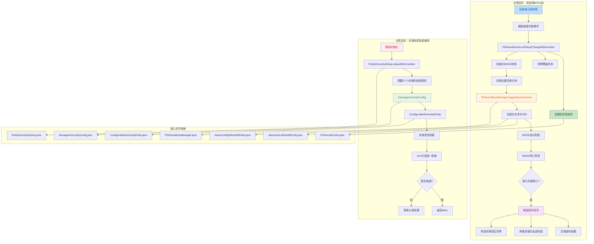

## 1. 高层概览（TL;DR）

- **影响范围**：🔴 **高** - 新增完整的竞技场BOSS战系统 + 重构27个实体的伤害免疫逻辑
- **核心变更**：
  - 🏟️ 新增亚伦柯斯竞技场BOSS战系统（维度、事件管理、BOSS实体、战利品）
  - 🛡️ 实体伤害免疫架构重构（从分散到集中配置）
  - 📦 模组版本升级至 0.0.4.0
  - 🗑️ 删除剧情文档和计划文档

---

## 2. 可视化概览（代码与逻辑映射）



---

## 3. 详细变更分析

### 🏟️ 3.1 竞技场BOSS战系统（新增核心功能）

#### 组件概览

| 组件 | 文件 | 职责 |
|------|------|------|
| **事件监听** | `PDArenaEvents.java` | 处理玩家进入竞技场维度、生成BOSS、清理实体 |
| **战斗管理** | `PDArenaBossManager.java` | 追踪BOSS存活状态、管理战斗阶段、生成战利品 |
| **传送门方块** | `AaroncosArenaPortalsBlock.java` | 主世界传送门，带感染效果 |
| **左手BOSS** | `AaroncosLefthand0Entity.java` | 500HP飞行BOSS，冲刺+重击+剑雨技能 |
| **右手BOSS** | `AaroncosRighthand0Entity.java` | 500HP飞行BOSS，配套技能 |
| **战利品箱** | `AaroncosHandChestBlock.java` | 战斗胜利后生成，含天赋分支战利品 |
| **召唤方块** | `AaroncosHandSpawnBlock.java` | 触发BOSS召唤的交互方块 |

#### 关键逻辑流程

**玩家进入竞技场时** (`PDArenaEvents.onPlayerChangedDimension`):
```java
// 1. 检查目标维度
if (!event.getTo().equals(AARONCOS_ARENA_WORLD_LEVEL_KEY)) return;

// 2. 竞技场玩家少于2人时初始化
if (arenaLevel.players().size() < 2) {
    placeArenaStructure(arenaLevel);      // 放置 aaroncos_arena.nbt 结构
    clearNonPlayerEntities(arenaLevel);  // 清除99格半径内非玩家实体
    PDArenaBossManager.initializeBossFight(arenaLevel); // 初始化为未召唤状态
}

// 3. 传送玩家到中心点 (0, 70, 0) 并赋予缓降效果
teleportPlayerToArena(entity);
player.addEffect(new MobEffectInstance(MobEffects.SLOW_FALLING, 600, 0, false, false));
```

**BOSS召唤流程** (`PDArenaBossManager.triggerBossSummon`):
```java
// 切换战斗阶段：NOT_SUMMONED → SUMMONING
setPhase(arenaLevel, BossFightPhase.SUMMONING);

// 生成左右手BOSS（召唤状态，AI禁用）
PDArenaEvents.spawnAaroncosBosses(arenaLevel);
// 左手位置: (12, 地面, 0), 面朝中心
// 右手位置: (-12, 地面, 0), 面朝中心
// 播放爆炸粒子 + 召唤音效
```

**战斗胜利序列** (`PDArenaBossManager.triggerVictorySequence`):
```java
// 1. 切换到 VICTORY 阶段
setPhase(arenaLevel, BossFightPhase.VICTORY);

// 2. 生成战利品箱 (0, 69, 0)
arenaLevel.setBlockAndUpdate(chestPos, AARONCOS_HAND_CHEST.get().defaultBlockState());

// 3. 40 tick 后掉落战利品
// 必定: PURE_HORROR ×1
// 光明天赋分支: WHITE_FLOWER_BODY + WHITE_CRYSTAL
// 暗影天赋分支: DEGENERATE_BODYS + SHADOW_HILT
```

#### 数据持久化

BOSS状态通过 `SavedData` 机制持久化：
- `AaroncosLeftHandAlive`: 左手存活状态
- `AaroncosRightHandAlive`: 右手存活状态
- `BossFightPhase`: 战斗阶段（NOT_SUMMONED / SUMMONING / FIGHTING / VICTORY）

---

### 🛡️ 3.2 实体伤害免疫重构（架构优化）

#### 重构前后对比

| 方面 | 重构前 | 重构后 |
|------|--------|--------|
| **代码位置** | 分散在27个实体类中 | 集中在 `EntityImmunitySetup.java` |
| **维护难度** | 高（修改需逐个修改实体类） | 低（统一配置） |
| **重复代码** | 大量重复的 `hurt()` 方法 | 无重复，基类统一处理 |
| **可扩展性** | 差（新增免疫需修改实体类） | 好（新增预设即可） |

#### 核心架构

```
ConfigurableImmunityEntity (基类)
    ↓ 继承
所有需要免疫配置的实体 (Monster / PathfinderMob)
    ↓ 使用
DamageImmunityConfig (单例配置中心)
    ↓ 配置于
EntityImmunitySetup.setupAllImmunities()
```

#### 实体免疫配置示例

**完全免疫** - 狐火（环境装饰实体）:
```java
config.configurePreset(PDEntities.FOX_FIRE.get(), 
    DamageImmunityConfig.Preset.FULL_IMMUNITY);
// 免疫：火焰、箭矢、玩家攻击、摔落、溺水、闪电、爆炸、凋零等
```

**自定义免疫** - 震动水晶（不含玩家爆炸）:
```java
config.configureImmunity(PDEntities.SHAKING_CRYSTAL.get(), Set.of(
    DamageTypes.IN_FIRE, DamageTypes.ON_FIRE, DamageTypes.LAVA,
    DamageTypes.ARROW, DamageTypes.PLAYER_ATTACK, ... // 完整列表
));
```

**物理免疫** - 暗影魔像:
```java
config.configureImmunity(PDEntities.SHADOW_GOLEM.get(), Set.of(
    DamageTypes.ARROW, DamageTypes.THROWN,
    DamageTypes.INDIRECT_MAGIC, DamageTypes.FALL, DamageTypes.CACTUS
));
```

**BOSS火焰免疫** - 亚伦柯斯左右手:
```java
config.configureImmunity(PDEntities.AARONCOS_LEFTHAND_0.get(), Set.of(
    DamageTypes.IN_FIRE, DamageTypes.ON_FIRE, DamageTypes.LAVA
));
```

#### 预定义免疫组合 (`DamageImmunityConfig.Preset`)

| 预设名称 | 免疫类型 |
|----------|----------|
| `FULL_IMMUNITY` | 火焰、箭矢、玩家攻击、摔落、溺水、闪电、爆炸、凋零等 |
| `ELEMENTAL_IMMUNITY` | 火焰、岩浆、溺水、闪电 |
| `PHYSICAL_IMMUNITY` | 箭矢、玩家攻击、摔落、仙人掌、三叉戟、铁砧 |
| `WITHER_IMMUNITY` | 凋零和凋零骷髅伤害 |
| `NONE` | 无免疫 |

---

### 📦 3.3 其他重要变更

#### 版本更新
| 配置项 | 旧值 | 新值 |
|--------|------|------|
| `mod_version` | `0.0.3.3` | `0.0.4.0` |

#### 音效注册
新增12个音效定义 (`sounds.json`):
```json
"aaroncos_spawn", "shadow_door", "shadow_vortex", "shadow_vortex_book",
"shadow_sword", "shadow_hand_lantern", "shadow_music_0", "shadow_trap_0",
"sword_wave", "sword1", "white_sword_rain", "skill0", "skill1", "skill2"
```

#### 维度JSON修复
`dyedream_world.json` 添加缺失的 `features` 字段，避免游戏崩溃。

#### 项目规则更新
添加 Minecraft 1.21 结构模板路径说明：
```markdown
| 结构模板 | `data/<modid>/structures/` | `data/<modid>/structure/` |
```

#### API文档更新
`DimensionAPI` 方法标记为 `@Deprecated` 并添加警告注释。

#### 删除的文件
- `docs/STORYLINE.md` - 剧情文档（564行）
- `docs/superpowers/plans/2026-05-30-structure-dimension-terrain-negotiation.md` - 未实施计划文档

---

## 4. 影响与风险评估

### ⚠️ 破坏性变更

| 变更类型 | 描述 | 影响范围 |
|----------|------|----------|
| **实体继承修改** | `ShadowGolemEntity` 继承从 `Monster` 改为 `ConfigurableImmunityEntity` | 仅影响此实体 |
| **伤害免疫逻辑迁移** | 27个实体的 `hurt()` 方法逻辑迁移至配置系统 | 全局影响，但行为保持一致 |

### 🔍 测试建议

**竞技场BOSS战**:
- ✅ 验证玩家进入竞技场维度时结构正确生成
- ✅ 验证BOSS召唤动画播放流畅
- ✅ 验证BOSS技能循环（冲刺→重击→剑雨）
- ✅ 验证两只手死亡后战利品箱生成
- ✅ 验证天赋分支战利品掉落条件（完成对应成就）
- ✅ 验证胜利后玩家传送回主世界

**实体伤害免疫**:
- ✅ 测试每个配置免疫的实体（狐火、暗影调和图腾、融梦水晶等）
- ✅ 验证免疫伤害类型实际生效
- ✅ 验证非免疫伤害类型正常扣血
- ✅ 测试 ShadowGolem 的受击加速技能逻辑

**维度与结构**:
- ✅ 验证竞技场传送门感染效果
- ✅ 验证竞技场结构文件正确加载

---

## 5. 总结

本次提交是一个**重大功能更新**，包含：

1. **🏟️ 竞技场BOSS战系统** - 完整的维度、事件管理、BOSS实体、战利品系统，约330+ 330+ 528 = 1188行核心代码
2. **🛡️ 实体伤害免疫重构** - 架构优化，从分散到集中配置，消除重复代码
3. **📦 版本升级** - 0.0.3.3 → 0.0.4.0
4. **🗑️ 文档清理** - 删除过时剧情和计划文档

代码质量高，注释详细，架构设计合理。建议重点测试竞技场BOSS战的完整流程和实体伤害免疫的各种场景。