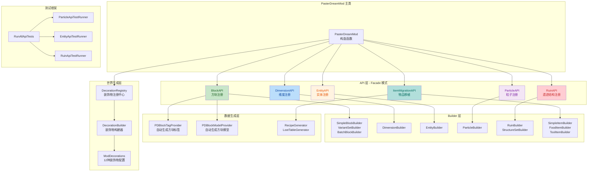
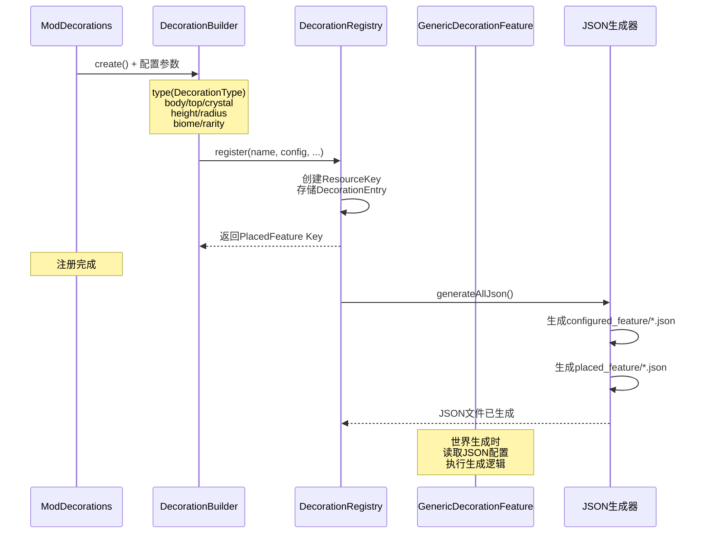

## 1. 高层摘要 (TL;DR)

*   **影响范围**：🔴 **高** - 涉及模组核心架构重构，新增5大API系统、装饰物生成系统、数据生成器和测试框架
*   **核心变更**：
    *   ✨ 新增 **5个统一API系统**（Block/Dimension/Entity/Particle/Ruin），采用 Facade + Builder 模式
    *   🏗️ 新增 **WorldDecorationAPI** 装饰物生成系统，支持冰刺、冰之门、方解石柱等12种装饰物
    *   📦 新增 **数据生成器**（BlockTagProvider/BlockModelProvider），自动生成方块标签和模型
    *   🧪 新增 **API测试框架**，提供4个Gradle任务用于验证API功能
    *   📝 版本升级：`0.0.1` → `0.0.3`
    *   🌐 语言文件扩展：新增20+物品翻译（武器、工具等）
    *   🔧 **主类重构**：移除旧的能力系统和配置系统，引入新的注册中心

---

## 2. 可视化架构图

### 2.1 API系统架构总览



### 2.2 装饰物生成流程



---

## 3. 详细变更分析

### 3.1 核心API系统

#### 🧱 BlockAPI - 方块注册API

**设计模式**：Facade + Builder 模式

**核心功能**：
*   **SimpleBlockBuilder**：批量注册「换皮」基础方块
*   **VariantSetBuilder**：一键生成建筑变体全家桶（楼梯、台阶、墙、栅栏）
*   **BatchBlockBuilder**：按编号批量注册同类型方块（花、草、矿石）

**使用示例**：
```java
// 模式一：基础换皮方块
BlockAPI.registerSimpleBlocks()
    .add("dyedream_block", Blocks.STONE)
    .build();

// 模式二：建筑变体族
BlockAPI.createVariantSet("dyedream_planks", Blocks.OAK_PLANKS)
    .withStairs().withSlab().withFence().build();

// 模式三：批量花/草
BlockAPI.batchRegister("flower")
    .indexList(1, 2, 3, 5, 6, 8, 9, 13, 14, 15, 16, 17)
    .factory(index -> new DyedreamFlowerBlock(...))
    .build();
```

**关键特性**：
*   自动存储 `BlockConfig` 供数据生成器读取
*   支持挖掘工具标签配置（axe/pickaxe/shovel/hoe）
*   支持模型类型配置（cube_all/cube_column/cube_top_bottom/cube_6）

---

#### 🌌 DimensionAPI - 维度注册API

**核心功能**：
*   链式配置维度类型参数（天光、床是否可用、环境光等）
*   自动生成 `dimension_type.json` 和 `dimension.json`
*   维度背景音乐注册
*   大型结构地形协商支持

**使用示例**：
```java
DimensionResult dyedreamWorld = DimensionAPI.createDimension("dyedream_world")
    .natural().hasSkylight().bedWorks()
    .withAmbientLight(0.5)
    .minY(-64).height(384)
    .monsterSpawnLight(0, 7)
    .withDefaultBlock("minecraft:calcite")
    .withNoiseSettings("pasterdream:dyedream_world")
    .build();

// 注册背景音乐
DimensionAPI.registerDimensionMusic("dyedream_world");
```

**地形协商系统**：
*   `StructureTerrainNegotiator`：评估地形适合性
*   `TerrainAssessment`：地形评估结果
*   `StructurePlacementRecord`：放置统计记录

---

#### 🎭 EntityAPI - 实体注册API

**核心功能**：
*   链式配置实体属性（分类、尺寸、追踪范围、属性模板）
*   自动缓存实体结果和属性配置
*   渲染器和属性注册辅助方法

**使用示例**：
```java
EntityResult<ShadowGolemEntity> shadowGolem = EntityAPI.createEntity("shadow_golem")
    .category(MobCategory.MONSTER)
    .size(2.2f, 3.5f)
    .trackingRange(64)
    .entityClass(ShadowGolemEntity.class)
    .attributes(ShadowGolemEntity::createAttributes)
    .build();

// 客户端注册渲染器
EntityAPI.registerRenderer(event, shadowGolem, ShadowGolemRenderer::new);

// 注册属性
EntityAPI.registerAttributes(event, shadowGolem);
```

**缓存机制**：
*   `ENTITY_CACHE`：实体结果缓存
*   `ATTRIBUTES_CACHE`：属性Supplier缓存
*   `SPAWN_EGG_COLORS`：生成蛋颜色缓存

---

#### ✨ ParticleAPI - 粒子注册API

**核心功能**：
*   链式配置粒子属性（是否始终显示、纹理、重力等）
*   自动生成 `particles/*.json` 和纹理元数据
*   Provider注册辅助（精灵表模式）

**使用示例**：
```java
ParticleResult sparkle = ParticleAPI.createParticle("sparkle")
    .alwaysShow()
    .texture("pasterdream:sparkle")
    .withGravity(0.05f)
    .build();

// 注册Provider
ParticleAPI.registerProviderSprite(event, "sparkle", SparkleParticle.Provider::new);
```

---

#### 🏛️ RuinAPI - 遗迹/结构注册API

**核心功能**：
*   链式配置结构类型（生物群系、模板池、地形适应等）
*   结构集配置（间距、分离值、盐值）
*   模板池JSON生成
*   大型结构诊断功能

**使用示例**：
```java
RuinResult result = RuinAPI.createRuin("dyedream_ruins")
    .biomeTag("pasterdream:is_dyedream")
    .templatePool("pasterdream:dyedream_ruins_pool")
    .structureClass(DyedreamRuinsStructure.class)
    .codec(DyedreamRuinsStructure.CODEC)
    .terrainAdaptation(TerrainAdaptation.BEARD_THIN)
    .build();

// 创建结构集
RuinAPI.createRuinSet("dyedream_ruins", "dyedream_ruins_set")
    .spacing(32).separation(8).salt(12345)
    .build();
```

**诊断功能**：
```java
// 打印所有结构生成统计
RuinAPI.printStructureDiagnostics();

// 评估地形适合性
TerrainAssessment assessment = RuinAPI.assessTerrain(
    "dyedream_ruins", chunkX, chunkZ, level);
```

---

### 3.2 WorldDecorationAPI - 装饰物生成系统

#### 🎨 装饰物类型

| 类型 | 说明 | 典型应用 |
|------|------|----------|
| `SPIKE` | 圆形截面锥形尖刺 | 冰刺、冰晶丛 |
| `PILLAR` | 方形截面锥形柱体 | 方解石柱、冰柱 |
| `BLOB` | 不规则椭球云团 | 坠云团块 |
| `GATE` | 双柱+横梁结构 | 冰之门 |
| `SCATTER` | 地面随机散布 | 冰晶花园 |
| `AQUATIC` | 水下珊瑚礁 | 珊瑚礁、粉红珊瑚丛 |
| `CUSTOM` | 自定义生成逻辑 | 冰之门（倒塌变种） |

#### 📋 已注册装饰物清单

| 装饰物名称 | 类型 | 目标群系 | 稀有度 | 特殊功能 |
|-----------|------|---------|--------|---------|
| `ice_spike` | SPIKE | biome_dyedream_2 | 2 | 悬空检测、区域重叠检测 |
| `ice_gate` | CUSTOM | biome_dyedream_2 | 5 | 完整/倒塌双变种 |
| `calcite_pillar` | PILLAR | biome_dyedream_1 | 3 | 表面嵌入染梦矿物 |
| `cloudfall_mound_dense` | BLOB | #is_dyedream | 1 | 密集云团 |
| `cloudfall_mound_sparse` | BLOB | #is_dyedream | 1 | 稀疏云团 |
| `ice_crystal_garden` | SCATTER | biome_dyedream_2 | 2 | 冰晶散布 |
| `patch_coral_reef` | AQUATIC | biome_dyedream_3 | 1 | 五种珊瑚块 |
| `patch_coral_reef_pink` | AQUATIC | biome_dyedream_3 | 1 | 粉色梦幻风格 |
| `ice_crystal_spike` | SPIKE | biome_dyedream_2 | 1 | 小型冰晶丛 |
| `ice_pillar` | PILLAR | biome_dyedream_2 | 1 | 高大冰柱 |
| `underwater_ice_spike` | SPIKE | biome_dyedream_3 | 1 | 水下冰刺 |
| `sea_ice_mound` | BLOB | biome_dyedream_3 | 1 | 海冰团块 |

---

### 3.3 数据生成器

#### 🏷️ PDBlockTagProvider

**功能**：自动读取 `BlockAPI.getBlockConfigs()` 中的 `mineable` 配置，生成方块挖掘标签

**支持的标签**：
*   `minecraft:mineable/axe`
*   `minecraft:mineable/pickaxe`
*   `minecraft:mineable/shovel`
*   `minecraft:mineable/hoe`

**工作流程**：
```java
// 在 PasterDreamMod 构造函数中注册
modEventBus.addListener(this::gatherData);

private void gatherData(GatherDataEvent event) {
    generator.addProvider(event.includeServer(),
        new PDBlockTagProvider(packOutput, lookupProvider, existingFileHelper));
}
```

---

#### 🎨 PDBlockModelProvider

**功能**：自动读取 `BlockAPI.getBlockConfigs()` 中的 `model/textures` 配置，生成方块状态和模型JSON

**支持的模型类型**：
| 模型类型 | 纹理配置 | 适用场景 |
|---------|---------|---------|
| `cube_all` | `all` | 六面相同纹理的方块 |
| `cube_column` | `end`, `side` | 原木、柱状方块 |
| `cube_top_bottom` | `top`, `side`, `bottom` | 上下不同的方块 |
| `cube_6` | `north`, `south`, `east`, `west`, `up`, `down` | 六面各异的方块 |

---

### 3.4 API测试框架

#### 🧪 测试运行器

| 测试类 | 测试内容 | Gradle任务 |
|--------|---------|-----------|
| `ParticleApiTestRunner` | 粒子API的Builder链式调用、JSON生成、缓存机制 | `runParticleApiTest` |
| `EntityApiTestRunner` | 实体API的Builder链式调用、验证逻辑、属性模板 | `runEntityApiTest` |
| `RuinApiTestRunner` | 遗迹API的Builder链式调用、JSON生成、模板池配置 | `runRuinApiTest` |
| `RunAllApiTests` | 一键运行所有API测试并汇总结果 | `runAllApiTests` |

---

### 3.5 Gradle构建系统增强

#### 📦 新增Gradle任务

| 任务名称 | 功能 | 入口类 |
|---------|------|--------|
| `runDimensionApiDemo` | 运行DimensionAPI示例程序 | `DimensionApiDemo` |
| `generateDimensionTestJsons` | 生成维度API测试JSON文件 | `DimensionJsonGenerator` |
| `runParticleApiTest` | 运行ParticleAPI测试 | `ParticleApiTestRunner` |
| `runEntityApiTest` | 运行EntityAPI测试 | `EntityApiTestRunner` |
| `runRuinApiTest` | 运行RuinAPI测试 | `RuinApiTestRunner` |
| `runAllApiTests` | 运行所有API测试 | `RunAllApiTests` |

**使用方式**：
```bash
# 运行单个API测试
./gradlew runParticleApiTest

# 运行所有API测试
./gradlew runAllApiTests

# 生成维度测试JSON
./gradlew generateDimensionTestJsons
```

---

### 3.6 主类重构

#### 🔄 PasterDreamMod.java 变更

**移除的组件**：
*   ❌ `MeltDreamEnergyCapability` - 融梦能量能力系统
*   ❌ `SanCapability` - 理智值能力系统
*   ❌ `PDClientConfig` / `PDCommonConfig` - 配置文件系统
*   ❌ `PDBiomeModifiers` - 生物群系修饰符序列化器

**新增的组件**：
*   ✅ `ItemMigrationAPI.REGISTRY` - 物品移植API注册器
*   ✅ `RuinAPI.REGISTRY` - 遗迹API注册器
*   ✅ `PDFeatures.FEATURES` - 自定义特征注册器
*   ✅ `DecorationRegistry.FEATURES` - 装饰物特征注册器
*   ✅ `PDSounds.SOUND_EVENTS` - 声音事件注册器
*   ✅ `gatherData()` - 数据生成事件处理
*   ✅ `DyeDreamSkyRenderer` - 染梦维度极光天幕渲染器
*   ✅ `PDClientEvents` - 客户端Tick事件

**关键代码变更**：
```java
// 新增数据生成事件监听
modEventBus.addListener(this::gatherData);

private void gatherData(final GatherDataEvent event) {
    DataGenerator generator = event.getGenerator();
    var packOutput = generator.getPackOutput();
    var lookupProvider = event.getLookupProvider();
    var existingFileHelper = event.getExistingFileHelper();

    generator.addProvider(event.includeServer(),
        new PDBlockTagProvider(packOutput, lookupProvider, existingFileHelper));

    generator.addProvider(event.includeClient(),
        new PDBlockModelProvider(packOutput, existingFileHelper));
}
```

---

### 3.7 语言文件扩展

#### 📝 新增物品翻译

**武器类（16种）**：
| 物品ID | 中文名 | 英文名 |
|--------|--------|--------|
| `broken_hero_sword` | 断裂英雄剑 | Broken Hero Sword |
| `copper_sword` | 铜剑 | Copper Sword |
| `creative_sword` | §4调试之剑 | Creative Sword |
| `desert_sword` | §e朔漠大剑 | Desert Sword |
| `dyedream_sword_0` | §e极锋染梦合金剑 | Dyedream Sword |
| `dyedream_sword` | 染梦合金剑 | Dyedream Sword |
| `grass_sword` | §e草薙 | Grass Sword |
| `iceshadow_hammer` | §e冰影战锤 | Iceshadow Hammer |
| `moltengold_sword` | 炙焰金剑 | Moltengold Sword |
| `shadow_erosion_sword` | §e影蚀匕首 | Shadow Erosion Sword |
| `shadow_sword` | §e影刃 | Shadow Sword |
| `terra_sword` | §e大地之刃 | Terra Sword |
| `thermal_dagger` | 热能匕首 | Thermal Dagger |
| `tide_sword` | §e引潮剑 | Tide Sword |
| `titanium_sword` | 钛金剑 | Titanium Sword |
| `white_sword` | §e白厄剑 | White Sword |

**工具类（8种）**：
| 物品ID | 中文名 | 英文名 |
|--------|--------|--------|
| `copper_pickaxe` | 铜镐 | Copper Pickaxe |
| `dyedream_hammer` | §e染梦合金锤 | Dyedream Hammer |
| `dyedream_pickaxe` | §e染梦合金镐 | Dyedream Pickaxe |
| `meltdream_pickaxe` | §b融梦水晶镐 | Meltdream Pickaxe |
| `moltengold_pickaxe` | 炙焰金镐 | Moltengold Pickaxe |
| `shadow_erosion_pickaxe` | §e影蚀镐 | Shadow Erosion Pickaxe |
| `titanium_pickaxe` | 钛金镐 | Titanium Pickaxe |
| `true_moltengold_pickaxe` | 狱炎镐 | True Moltengold Pickaxe |

**音乐唱片（9种）**：
| 物品ID | 中文名 | 英文名 |
|--------|--------|--------|
| `sweetdream_disc` | 音乐唱片 - 甜蜜的梦 | Sweetdream Disc |
| `snowfalldream_disc` | 音乐唱片 - 落雪之梦 | Snowfalldream Disc |
| `aaroncos_disc` | 音乐唱片 - 亚伦柯斯之触 | Aaroncos Disc |
| `wind_journey_disc` | 音乐唱片 - 风之旅途 | Wind Journey Disc |
| `dream_meadow_disc` | 音乐唱片 - 梦之原野 | Dream Meadow Disc |
| `dream_heath_disc` | 音乐唱片 - 梦之石楠 | Dream Heath Disc |
| `dream_taiga_disc` | 音乐唱片 - 梦之泰加 | Dream Taiga Disc |
| `dream_delta_disc` | 音乐唱片 - 梦之三角洲 | Dream Delta Disc |

---

### 3.8 版本与配置变更

#### 📦 版本升级

| 配置项 | 旧值 | 新值 | 说明 |
|--------|------|------|------|
| `mod_version` | `0.0.1` | `0.0.3` | 模组版本升级 |

#### 🏷️ 物品重命名

| 旧名称 | 新名称 | 原因 |
|--------|--------|------|
| `yinhul_cotton_candy` | `silver_fox_cotton_candy` | 统一命名规范 |

---

## 4. 影响与风险评估

### ⚠️ 破坏性变更

| 变更类型 | 影响范围 | 说明 |
|---------|---------|------|
| **能力系统移除** | 高 | `MeltDreamEnergyCapability` 和 `SanCapability` 已完全移除，依赖这些系统的功能将失效 |
| **配置系统移除** | 中 | `PDClientConfig` 和 `PDCommonConfig` 已移除，所有配置需重新实现 |
| **物品重命名** | 低 | `yinhul_cotton_candy` 重命名为 `silver_fox_cotton_candy`，可能影响存档兼容性 |

### 🧪 测试建议

1.  **API功能测试**：
    *   运行 `./gradlew runAllApiTests` 验证所有API注册逻辑
    *   检查数据生成器是否正确生成方块标签和模型JSON

2.  **装饰物生成测试**：
    *   进入染梦维度，验证12种装饰物是否正确生成
    *   检查冰之门的双变种（完整/倒塌）是否按预期出现

3.  **语言文件测试**：
    *   验证所有新增物品的中英文翻译是否正确显示
    *   检查音乐唱片的描述和字幕是否正常

4.  **兼容性测试**：
    *   测试旧存档中 `yinhul_cotton_candy` 是否正确转换为 `silver_fox_cotton_candy`
    *   验证移除的能力系统不会导致游戏崩溃

### 📊 性能影响

*   **正面影响**：数据生成器自动生成资源文件，减少手动维护成本
*   **潜在风险**：装饰物生成系统增加了世界生成时的计算量，需关注生成性能

---

## 5. 总结

本次变更是一次**大规模架构重构**，核心目标是：

1.  **统一API设计**：通过5大API系统（Block/Dimension/Entity/Particle/Ruin）实现一致的注册体验
2.  **自动化数据生成**：引入数据生成器，自动生成方块标签、模型等资源文件
3.  **装饰物系统**：新增WorldDecorationAPI，支持12种装饰物的灵活配置
4.  **测试框架**：提供完整的API测试套件，确保代码质量

**建议后续工作**：
*   为移除的能力系统提供迁移指南或替代方案
*   补充装饰物系统的文档和使用示例
*   考虑为数据生成器添加更多自定义选项