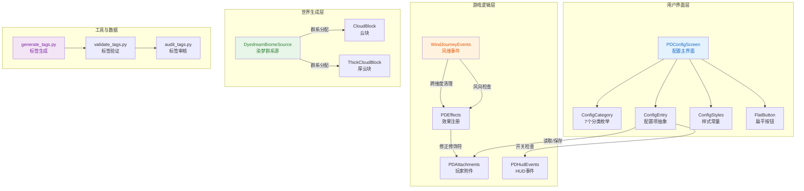

## 高层摘要 (TL;DR)

- **影响**：中等 - 新增完整的原生配置UI系统，修复风向机制残留问题，优化云块物理属性与染梦世界生成
- **核心变更**：
  - 🎨 新增**47项配置项**的原生配置界面（7个分类：HUD/BASIC/PROPERTY/BAN/BGM/SAN/MELTDREAM）
  - 🐛 修复**风之旅途跨维度时顺风/逆风效果残留**的bug
  - ⚡ 优化**云块物理属性**以改善风维移动体验
  - 🗺️ 扩展**染梦世界群系生成**（新增海岸、密林群系）
  - 🔧 集成**系统开关配置**到San与融梦能量系统
  - 🏷️ 新增**标签系统生成与审核脚本**

---

## 可视化概览 (代码与逻辑映射)



---

## 详细变更分析

### 🎨 组件一：原生配置界面系统 (新增)

**业务目标**：为PasterDream模组提供完整的原生成型配置界面，替代或补充第三方配置库，支持47项配置的分类管理与即时保存。

**主要文件**：
- `PDConfigScreen.java` - 主配置屏幕 (669行，新建)
- `ConfigCategory.java` - 分类枚举 (54行，新建)
- `ConfigEntry.java` - 配置项抽象基类 (569行，新建)
- `ConfigStyles.java` - 视觉样式常量 (187行，新建)
- `FlatButton.java` - 扁平风格按钮 (133行，新建)

#### 🏗️ 架构设计

| 模块 | 职责 | 关键特性 |
|------|------|----------|
| `PDConfigScreen` | 主屏幕容器 | 双栏布局、分类导航、滚动列表、动画系统 |
| `ConfigCategory` | 分类枚举 | HUD/BASIC/PROPERTY/BAN/BGM/SAN/MELTDREAM 7类 |
| `ConfigEntry` | 配置项抽象 | BooleanEntry/NumberEntry，待保存值机制 |
| `ConfigStyles` | 样式系统 | 深海梦境主题、低饱和青绿强调色 |
| `FlatButton` | 交互控件 | 悬停/按下动画、状态切换 |

#### 📊 配置项统计

| 分类 | 数量 | 配置示例 |
|------|------|----------|
| HUD | 4 | `ENABLE_MOD_UI`, `PASTER_HEALTH_HUD` |
| SAN | 7 | `ENABLE_SAN_SYSTEM`, `SHOW_SAN_HUD`, `SAN_HUD_SCALE` |
| MELTDREAM | 7 | `ENABLE_MELTDREAM_ENERGY_SYSTEM`, `MELTDREAM_ENERGY_HUD_SCALE` |
| BASIC | 14 | `OVERWORLD_NIGHT_LOWERS_SAN`, `DYEDREAM_CRACK_GENERATE` |
| PROPERTY | 1 | `PLAYER_TOTAL_TICK_UPDATE` |
| BAN | 4 | `BAN_ALL_THE_WINGS`, `BAN_TERRA_SWORD` |
| BGM | 8 | `BGM_MASTER_ENABLED`, `BGM_DYEDREAM_WORLD`, `BGM_DREAM_HEATH` |

#### 🎨 视觉设计亮点

```java
// 深海梦境主题配色 (ConfigStyles.java)
COLOR_BG = 0xFF0A0D12           // 极深蓝灰背景
COLOR_SIDEBAR_BG = 0xFF0E1218   // 侧边栏背景
COLOR_ACCENT = 0xFF4ECDC4       // 主强调色（低饱和青绿）
COLOR_SUCCESS = 0xFF5ECF9A      // 正面反馈色
```

**动画系统**：
- 📺 屏幕淡入：`SCREEN_FADE_IN_MS = 100ms`
- 🎬 面板进入：`SCREEN_ENTER_MS = 220ms`，带缩放与上浮
- 🔄 分类切换：`CATEGORY_SWITCH_DURATION_MS = 120ms`
- ✨ 变更反馈：`CHANGE_FEEDBACK_MS = 160ms`，柔和单色闪烁
- 💾 保存成功：`SAVE_FEEDBACK_MS = 300ms`，绿色闪烁

#### 🔑 关键逻辑

**配置项初始化** (PDConfigScreen.java:117-197)：
```java
private void buildEntries() {
    int idx = 0;
    // Client HUD (4 items)
    allEntries.add(new ConfigEntry.BooleanEntry(PDClientConfig.ENABLE_MOD_UI, ConfigCategory.HUD, idx++));
    allEntries.add(new ConfigEntry.BooleanEntry(PDClientConfig.STEALTH_DISPLAY_ATTRIBUTE_HUD, ConfigCategory.HUD, idx++));
    // ... 47项配置
}
```

**分类切换动画** (PDConfigScreen.java:254-266)：
```java
private void switchCategory(ConfigCategory category) {
    if (category == selectedCategory) return;
    selectedCategory = category;
    categorySwitchStart = System.currentTimeMillis();
    categorySlideOffset = 28f;  // 滑动偏移量
    rebuildVisibleEntries();
    updateWidgetPositions();
    updateCategoryButtonStyles();
}
```

---

### 🐛 组件二：风向机制修复

**业务目标**：修复风之旅途维度跨维度时顺风/逆风效果残留的问题，避免玩家返回主世界后仍受移动速度修饰符影响。

**主要文件**：
- `WindJourneyEvents.java` - 跨维度清理逻辑
- `PDEffects.java` - 修饰符移除逻辑优化

#### 🔧 修复详情

**跨维度清理** (WindJourneyEvents.java:56-59)：
```java
// 离开风维时清理顺风/逆风效果
if (event.getFrom().equals(PDDimensions.WIND_JOURNEY_WORLD_LEVEL_KEY)) {
    player.removeEffect(PDEffects.DEADWIND_BUFF.holder());  // 移除逆风
    player.removeEffect(PDEffects.TAILWIND_BUFF.holder());  // 移除顺风
}
```

**修饰符刷新优化** (PDEffects.java:1016-1045)：
```java
// 逆风生效：先摘旧修饰符，再添加新修饰符
private static void deadwindApply(LivingEntity entity, Integer amplifier) {
    entity.removeEffect(TAILWIND_BUFF.holder());
    deadwindRemove(entity, amplifier);  // 🔥 新增：先移除旧修饰符
    if (amplifier == 0) {
        addPermanentIfAbsent(entity, Attributes.MOVEMENT_SPEED, modifierId("deadwind_buff_0"),
                -0.02, AttributeModifier.Operation.ADD_VALUE);
    }
    // ...
}

// 顺风生效：同样先移除再添加
private static void tailwindApply(LivingEntity entity, Integer amplifier) {
    entity.removeEffect(DEADWIND_BUFF.holder());
    tailwindRemove(entity, amplifier);  // 🔥 新增：保证数值刷新
    // ...
}
```

**为什么需要此修复**：
- 风向Buff会通过`addPermanentIfAbsent`添加`AttributeModifier`到玩家属性
- 跨维度时只移除Buff效果，但永久修饰符仍附着在玩家属性上
- 先调用`deadwindRemove/tailwindRemove`确保旧修饰符被完全清理，避免数值累积或卡死

---

### ⚙️ 组件三：系统配置集成

**业务目标**：将San系统与融梦能量系统的开关集成到配置检查中，允许玩家在不开系统的环境下完全禁用相关逻辑。

**主要文件**：
- `PDAttachments.java` - 玩家附件系统
- `PDHudEvents.java` - HUD渲染事件
- `PDSanHelper.java` - San计算助手

#### 🔄 配置检查集成

**San系统配置检查** (PDAttachments.java:111-131)：
```java
// 设置玩家San值（新增配置检查）
public static void setPlayerSanWithCheck(Player player, double san) {
    if (player instanceof ServerPlayer sp
            && sp.level().getGameRules().getBoolean(PDGameRules.SAN_CHECK_SYSTEM)
            && Boolean.TRUE.equals(PDCommonConfig.ENABLE_SAN_SYSTEM.get())) {  // 🔥 新增
        setPlayerSan(sp, san);
    }
}

// 增减玩家San值（新增配置检查）
public static void addPlayerSanWithCheck(Player player, double san) {
    if (player instanceof ServerPlayer sp
            && sp.level().getGameRules().getBoolean(PDGameRules.SAN_CHECK_SYSTEM)
            && Boolean.TRUE.equals(PDCommonConfig.ENABLE_SAN_SYSTEM.get())) {  // 🔥 新增
        addPlayerSan(sp, san);
    }
}
```

**融梦能量系统配置检查** (PDAttachments.java:153-216)：
```java
// 设置融梦能量
public static void setPlayerMeltDreamEnergy(Player player, double value) {
    if (player instanceof ServerPlayer sp && Boolean.TRUE.equals(PDCommonConfig.ENABLE_MELTDREAM_ENERGY_SYSTEM.get())) {
        // ...
    }
}

// 尝试消耗融梦能量
public static boolean consumePlayerMeltDreamEnergy(Player player, double value) {
    MeltDreamEnergyData data = player.getData(PLAYER_MELTDREAM_ENERGY);
    if (player instanceof ServerPlayer sp) {
        // 🔥 新增：系统关闭时直接成功
        if (!Boolean.TRUE.equals(PDCommonConfig.ENABLE_MELTDREAM_ENERGY_SYSTEM.get())
                || data.isNoNeedConsume() || sp.isCreative()) {
            return true;
        }
        // ...
    }
}
```

**HUD渲染配置检查** (PDHudEvents.java:29-31)：
```java
// 关闭模组UI时恢复原版血条渲染
if (!PDClientConfig.ENABLE_MOD_UI.get() || !PDClientConfig.PASTER_HEALTH_HUD.get()) {
    return;
}
```

**防御性读取优化** (PDSanHelper.java:64-72)：
```java
// 防御性读取：避免TOML中存在浮点污染导致Integer类型转换崩溃
int totalInterval;
Object rawInterval = PDCommonConfig.PLAYER_TOTAL_TICK_UPDATE.getRaw();
if (rawInterval instanceof Number number) {
    totalInterval = Math.max(1, number.intValue());
} else {
    totalInterval = Math.max(1, PDCommonConfig.PLAYER_TOTAL_TICK_UPDATE.get());
}
```

---

### ☁️ 组件四：云块物理属性优化

**业务目标**：通过调整云块的摩擦力、速度因子和跳跃因子，改善风之旅途维度的移动体验，减轻「实心碎岛」上的拖沓体感。

**主要文件**：
- `CloudBlock.java` - 普通云块
- `ThickCloudBlock.java` - 厚重云块

#### ⚡ 物理属性对比

| 方块 | 摩擦力 | 速度因子 | 跳跃因子 | 效果说明 |
|------|--------|----------|----------|----------|
| 原版基岩 | 0.6 | 1.0 | 1.0 | 标准参照 |
| CloudBlock (普通云) | **0.5** ↓ | **1.25** ↑ | **1.1** ↑ | 轻盈踏云感，加速+助跳 |
| ThickCloudBlock (厚云) | **0.55** ↓ | **1.2** ↑ | **1.05** ↑ | 保持实心碰撞，轻微加速 |

#### 🔧 代码变更

**CloudBlock.java**：
```java
public CloudBlock() {
    super(BlockBehaviour.Properties.of()
            .ignitedByLava()
            .sound(SoundType.WOOL)
            .strength(0.2f, 0f)
            .noOcclusion()
            .isRedstoneConductor((bs, br, bp) -> false)
            .friction(0.5f)           // 🔥 新增：降低摩擦力
            .speedFactor(1.25f)       // 🔥 新增：提升速度
            .jumpFactor(1.1f));       // 🔥 新增：提升跳跃
}
```

**ThickCloudBlock.java**：
```java
public ThickCloudBlock() {
    super(BlockBehaviour.Properties.of()
            .ignitedByLava()
            .sound(SoundType.WOOL)
            .strength(0.3f, 0.5f)
            .friction(0.55f)          // 🔥 新增：轻微降低摩擦力
            .speedFactor(1.2f)        // 🔥 新增：提升速度
            .jumpFactor(1.05f));      // 🔥 新增：轻微提升跳跃
}
```

**设计理念**：
- 🌬️ **friction降低**：减少滑行阻力，让踏云更轻盈
- 🏃 **speedFactor提升**：云上移动速度比普通方块快20-25%
- 🦘 **jumpFactor提升**：云上跳跃高度提升5-10%，增强"云上飘行"的感觉
- 🧱 **ThickCloud保持实心碰撞**：作为风维default_block，保证实体碰撞同时改善体感

---

### 🗺️ 组件五：染梦世界群系生成扩展

**业务目标**：扩展染梦世界的群系多样性，新增海岸群系和密林群系，通过湿度噪声控制山脊区域的群系分配。

**主要文件**：
- `DyedreamBiomeSource.java` - 群系源逻辑

#### 🌍 群系分配逻辑更新

**变更前（6个群系）**：
1. 大陆性噪声 < -0.35 → 深海群系
2. 大陆性噪声 < -0.19 → 浅海/海岸群系
3. 蘑菇平原独立噪声命中 → 蘑菇平原群系
4. 温度噪声 < -0.35 → 雪原群系
5. 山脊噪声 > 0.3 → 高原群系
6. 其余 → 平原群系

**变更后（8个群系）**：
1. 大陆性噪声 < -0.35 → 深海群系 (biomes[0])
2. 大陆性噪声 < -0.19 → 浅海群系 (biomes[1])
3. 大陆性噪声 < -0.05 → **海岸群系 (biomes[2])** 🆕
4. 蘑菇平原独立噪声命中 → 蘑菇平原群系 (biomes[7])
5. 温度噪声 < -0.35 → 雪原群系 (biomes[6])
6. 山脊噪声 > 0.3 且 **湿度 > 0.15** → **密林群系 (biomes[5])** 🆕
7. 山脊噪声 > 0.3 → 森林/高地群系 (biomes[4])
8. 其余 → 平原群系 (biomes[3])

#### 🔑 关键代码变更

**新增阈值常量** (DyedreamBiomeSource.java:58-68)：
```java
/** 大陆性噪声海岸判定阈值 */
private static final double SHORE_THRESHOLD = -0.05;

/** 密林湿度阈值，湿度噪声高于此值时山脊区域判定为密林而非普通森林 */
private static final double DENSE_FOREST_HUMIDITY_THRESHOLD = 0.15;
```

**群系分配逻辑** (DyedreamBiomeSource.java:235-274)：
```java
public Holder<Biome> getNoiseBiome(int x, int y, int z, Climate.Target target) {
    double continentalness = target.continentalness();
    double ridges = target.weirdness();
    double temperature = target.temperature();
    double humidity = target.humidity();  // 🔥 新增：读取湿度噪声

    // 深海
    if (continentalness < DEEP_OCEAN_THRESHOLD) {
        return getBiomeSafe(0);
    }

    // 浅海
    if (continentalness < SHALLOW_OCEAN_THRESHOLD) {
        return getBiomeSafe(1);
    }

    // 🔥 新增：海岸
    if (continentalness < SHORE_THRESHOLD) {
        return getBiomeSafe(2);
    }

    // 蘑菇平原：稀有特殊群系，基于独立噪声判定
    if (isMushroomPlains(bx, bz)) {
        return getBiomeSafe(7);
    }

    // 雪原：低温区域
    if (temperature < SNOW_TEMPERATURE_THRESHOLD) {
        return getBiomeSafe(6);
    }

    // 🔥 优化：山脊区域：森林/高地，湿度较高时生成为密林而非普通森林
    if (ridges > HILLS_RIDGE_THRESHOLD) {
        return humidity > DENSE_FOREST_HUMIDITY_THRESHOLD
                ? getBiomeSafe(5)  // 密林
                : getBiomeSafe(4); // 森林/高地
    }

    // 默认：平原
    return getBiomeSafe(3);
}
```

#### 📊 群系索引映射表

| 索引 | 群系名称 | 判定条件 |
|------|----------|----------|
| 0 | 深海群系 | `continentalness < -0.35` |
| 1 | 浅海群系 | `continentalness < -0.19` |
| 2 | **海岸群系** 🆕 | `continentalness < -0.05` |
| 3 | 平原群系 | 默认 |
| 4 | 森林/高地群系 | `ridges > 0.3` 且 `humidity ≤ 0.15` |
| 5 | **密林群系** 🆕 | `ridges > 0.3` 且 `humidity > 0.15` |
| 6 | 雪原群系 | `temperature < -0.35` |
| 7 | 蘑菇平原群系 | 蘑菇噪声命中 |

---

### 🏷️ 组件六：标签系统工具脚本

**业务目标**：提供自动化的标签生成、验证和审核工具，确保模组物品/方块的标签系统完整性与一致性。

**主要文件**：
- `generate_tags.py` - 标签生成脚本
- `validate_tags.py` - 标签验证脚本
- `audit_tags.py` - 标签审核脚本
- `tag_audit.json` - 审核结果文件 (新建)

#### 🛠️ 工具功能

| 脚本 | 功能 | 输出 |
|------|------|------|
| `generate_tags.py` | 从注册表生成标签JSON | 写入`data/`目录 |
| `validate_tags.py` | 提取注册ID并与标签对比 | 验证报告 |
| `audit_tags.py` | 审核标签完整性 | 审核结果JSON |
| `tag_audit.json` | 审核结果存储 | 块/物品ID列表 |

#### 🔍 代码片段

**标签写入函数** (generate_tags.py:12-28)：
```python
def write_tag(path: Path, values: list, replace: bool = False):
    """写入标签JSON，保留已有条目并去重。"""
    ensure_dir(path)
    existing = []
    if path.exists():
        try:
            data = json.loads(path.read_text(encoding='utf-8'))
            for v in data.get('values', []):
                if isinstance(v, str):
                    existing.append(v)
                elif isinstance(v, dict) and 'id' in v:
                    existing.append(v['id'])
        except Exception:
            pass
    merged = sorted(set(existing) | set(values))
    data = {"replace": replace, "values": merged}
    path.write_text(json.dumps(data, ensure_ascii=False, indent=2) + '\n', encoding='utf-8')
```

**注册提取模式** (validate_tags.py:13-23)：
```python
patterns = [
    r'\.registerBlock\s*\(\s*"([^"]+)"',
    r'\.register\s*\(\s*"([^"]+)"',
    r'\.registerSimpleItem\s*\(\s*"([^"]+)"',
    r'\.registerItem\s*\(\s*"([^"]+)"',
    r'\.registerSimpleBlockItem\s*\(\s*"([^"]+)"',
    # ... 更多模式
]
```

---

## 影响与风险评估

### ⚠️ 破坏性变更

| 类别 | 变更内容 | 影响范围 |
|------|----------|----------|
| API | `PDAttachments` 中的San/融梦能量方法新增配置检查 | 所有调用这些方法的代码 |
| 群系 | 染梦世界群系索引重新映射（6→8） | 染梦世界已生成的区块可能不兼容 |
| 配置 | 新增配置界面，默认配置可能与用户自定义TOML冲突 | 直接编辑TOML文件的玩家 |

### ✅ 测试建议

1. **配置界面测试**：
   - 验证7个分类切换动画流畅性
   - 测试47项配置项的保存/重置功能
   - 检查数值输入框的边界验证与错误提示

2. **风向机制测试**：
   - 进入风维 → 获得顺风/逆风Buff
   - 跨维度返回主世界 → 验证Buff与修饰符已清理
   - 重新进入风维 → 验证风向系统正常工作

3. **云块物理测试**：
   - 普通云块：验证移动速度提升20-25%
   - 厚云块：验证轻微加速效果，保持实体碰撞
   - 对比原版基岩方块的移动体验

4. **染梦世界生成测试**：
   - 创建新世界 → 验证海岸群系在大陆边缘生成
   - 湿度高的山脊区域 → 验证密林群系生成
   - 现有世界升级 → 验证群系过渡平滑

5. **系统开关测试**：
   - 关闭San系统 → 验证San值不再变化
   - 关闭融梦能量系统 → 验证能量消耗直接成功
   - 关闭模组UI → 验证原版血条正常显示

---

## 附录：资源文件变更

### 📁 新增资源文件摘要

| 类型 | 数量 | 路径模式 |
|------|------|----------|
| 配置界面类 | 5 | `client/gui/config/*.java` |
| 生成标签文件 | 100+ | `generated/resources/assets/pasterdream/blockstates/*.json` |
| 标签数据 | 100+ | `main/resources/data/{c,minecraft}/tags/**/*.json` |
| 审核文件 | 1 | `tag_audit.json` |
| 工具脚本 | 3 | `*.py` |
| 分析文档 | 1 | `tmp_风之旅途移动困难_风向机制分析.md` |

### 🌍 语言文件

- `assets/pasterdream/lang/zh_cn.json` - 配置界面中文翻译（未在diff中展示，预期新增）

---