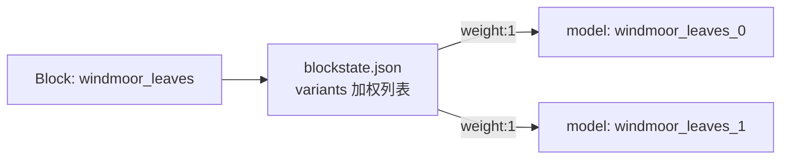

## 1. 高层摘要 (TL;DR)

*   **影响程度**：🟡 **中等** — 涉及战利品系统重构、新方块引入与大量资源文件联动
*   **关键变更**：
    *   🌟 **战利品系统重构**：`MeltdreamChestBlock` 从硬编码物品池(`MeltdreamChestLootConfig`)迁移到 Minecraft 原生 JSON 战利品表
    *   ✨ **新方块引入**：新增 `windmoor_hanging_vine`(风泊悬挂藤)，支持骨粉催长向下生成藤
    *   🔀 **叶块合并**：将 `windmoor_leaves_0/1/2` 三个方块合并为一个 `windmoor_leaves`，通过 blockstate 随机变体实现纹理随机化
    *   🎨 **粒子优化**：`DyedreamEnvironmentRenderer` 粒子向前方偏移生成，停留时间延长
    *   🗺️ **新增世界噪声设置**：`wind_journey_world.json` 风之旅维度地形生成定义

---

## 2. 可视化概览 (代码与逻辑图谱)

### 2.1 战利品系统重构流程

```mermaid
flowchart TD
    subgraph 旧方案["旧方案 (已废弃)"]
        A1[玩家打开融梦箱] --> B1{选择品质}
        B1 -->|普通/稀有/传说| C1[MeltdreamChestLootConfig]
        C1 --> D1["parsePool() 解析字符串列表"]
        D1 --> E1["rollFromPool() 按权重随机"]
        E1 --> F1["fillItems() 填入物品栏"]
    end

    subgraph 新方案["新方案 (JSON 战利品表)"]
        A2[玩家打开融梦箱] --> B2{选择品质}
        B2 -->|1/2/3| C2["switch → lootTableId"]
        C2 --> D2["generateFromLootTable()"]
        D2 --> E2["serverLevel.reloadableRegistries().getLootTable()"]
        E2 --> F2["lootTable.getRandomItems(params)"]
        F2 --> G2["fillItemsWithLootTable() 填入物品栏"]
        G2 --> H2["硬编码: rollDisc() / rollDoll()"]
    end

    style 旧方案 fill:#ffcdd2,color:#b71c1c
    style 新方案 fill:#c8e6c9,color:#1b5e20
```



### 2.2 风泊悬挂藤生长逻辑

```mermaid
flowchart TD
    A["WindmoorHangingVineBlock<br/>(悬挂藤)"] --> B{canSurvive()<br/>上方支撑?}
    B -->|原木/木板/树叶/矿石| C[放置成功]
    B -->|其他| D[方块掉落]

    C --> E[随机刻触发]
    E --> F{probability 5%}
    F -->|命中| G["tryGrowDown()"]
    G --> H{下方是否空气?}
    H -->|否| X[结束]
    H -->|是| I{藤链长度 > 12?}
    I -->|是| X
    I -->|否| J["放置 fig_vine"]
    J --> K{AGE < 2?}
    K -->|是| L["AGE++"]
    K -->|否| X

    C --> M[骨粉催长]
    M --> N["performBonemeal()"]
    N --> G
    N --> O{概率 60%}
    O -->|命中| P[额外再生长一格]

    style A fill:#fff3e0,color:#e65100
    style G fill:#c8e6c9,color:#1b5e20
    style M fill:#bbdefb,color:#0d47a1
```

### 2.3 叶块合并方案对比

| 维度 | 旧方案 (3 方块) | 新方案 (1 方块 + JSON 变体) |
|------|----------------|---------------------------|
| 注册数量 | `windmoor_leaves_0/1/2` | `windmoor_leaves` |
| 纹理随机化 | 通过不同方块ID | blockstate JSON `variants` 加权数组 |
| 物品栏显示 | 3 个独立物品 | 1 个合并物品 |
| Tag 注册 | 需注册 3 次 | 只需注册 1 次 |



---

## 3. 详细变更分析

### 3.1 ⚙️ 战利品系统重构 (Meltdream Chest)

**📂 修改文件**：
* `PasterDream/src/main/java/com/pasterdream/pasterdreammod/block/MeltdreamChestBlock.java` — 重构核心
* `PasterDream/src/main/java/com/pasterdream/pasterdreammod/config/MeltdreamChestLootConfig.java` — **整文件删除**
* `PasterDream/src/main/java/com/pasterdream/pasterdreammod/config/PDCommonConfig.java` — 移除配置定义
* `PasterDream/src/main/java/com/pasterdream/pasterdreammod/client/gui/config/ConfigCategory.java` — 移除 `MELTDREAM_CHEST` 枚举
* `PasterDream/src/main/java/com/pasterdream/pasterdreammod/client/gui/config/PDConfigScreen.java` — 移除配置 UI 入口

**🔍 关键逻辑变更**：

| 阶段 | 旧行为 | 新行为 |
|------|-------|-------|
| 物品池加载 | 解析 `List<String>` TOML 配置 | 调用 `LootTable.getRandomItems()` |
| 品质路由 | `MeltdreamChestLootConfig.getCommonLoot/Rare/Legendary` | 硬编码 `lootTableId` (`pasterdream:chests/meltdream_*`) |
| 唱片保留 | 在物品池中查询 | `rollDisc()` 单独处理，不走战利品表 |
| 玩偶保留 | 在物品池中随机替换 | `rollDoll()` 单独处理 |
| 传说水晶 | 硬编码第9格 | 硬编码第9格 (未变) |

**📝 新增 JSON 战利品表**：

| 文件 | 槽位策略 | 备注 |
|------|---------|------|
| `meltdream_common.json` | rolls=2, count 1~3 | 17 个食物条目 |
| `meltdream_rare.json` | rolls=5, count 1~2 | 17 个稀有材料+装备 |
| `meltdream_legendary.json` | rolls=6 + 1 固定 | 10 个传说物品 + 强制 1 个 meltdream_crystal_0 |

> **注**：原 `MeltdreamChestLootConfig` 类的三个默认物品池数据**完整保留**到了对应 JSON 文件中，但通过 Minecraft 原生 `getRandomItems` API 调用,失去了 `MELTDREAM_CHEST_CUSTOM_LOOT_ENABLED` 配置项支持。

---

### 3.2 🌿 新方块：风泊悬挂藤 (Windmoor Hanging Vine)

**📂 新增文件**：
* `PasterDream/src/main/java/com/pasterdream/pasterdreammod/block/WindmoorHangingVineBlock.java` — 完整 Java 类 (232 行)
* `assets/pasterdream/blockstates/windmoor_hanging_vine.json` — 方块状态
* `assets/pasterdream/models/block/windmoor_hanging_vine.json` — 模型 (cross 十字)
* `assets/pasterdream/models/item/windmoor_hanging_vine.json` — 物品模型
* `data/pasterdream/loot_table/blocks/windmoor_hanging_vine.json` — 破坏战利品

**🎯 核心特性**：

| 属性 | 取值/描述 |
|------|----------|
| 支撑方块 | 原木(`LOGS`)、木板(`PLANKS`)、树叶(`LEAVES`)、石质/深板岩矿石可替换 |
| VoxelShape | `box(2, 0, 2, 14, 10, 14)` 底部薄片 |
| 状态属性 | `AGE`(0~2)、`SUPPRESSED`(防链式触发) |
| 生长上限 | 单链最大 12 格 |
| 生长概率 | 随机刻 5%、骨粉 60% 二次生长 |
| 生长产物 | 向下生成 `PDBlocks.FIG_VINE` |
| 视觉 | `getVisualShape` 返回空 Shapes.empty() |

---

### 3.3 🍃 风泊树叶合并

**🗑️ 已删除文件**：
```
✗ assets/pasterdream/blockstates/windmoor_leaves_2.json
✗ assets/pasterdream/models/block/windmoor_leaves_2.json
✗ assets/pasterdream/models/item/windmoor_leaves_2.json
✗ data/pasterdream/loot_table/blocks/windmoor_leaves_0.json
✗ data/pasterdream/loot_table/blocks/windmoor_leaves_1.json
✗ data/pasterdream/loot_table/blocks/windmoor_leaves_2.json
```

**➕ 新增文件**：
```
+ assets/pasterdream/blockstates/windmoor_leaves.json  (加权变体)
+ assets/pasterdream/models/item/windmoor_leaves.json   (父模型)
+ data/pasterdream/loot_table/blocks/windmoor_leaves.json
```

**🏷️ Tag 文件更新**：
* `data/minecraft/tags/block/leaves.json`
* `data/minecraft/tags/item/leaves.json`
* `data/c/tags/block/leaves.json`
* `data/c/tags/item/leaves.json`

均将三个旧条目合并为单个 `pasterdream:windmoor_leaves`。

---

### 3.4 🎨 粒子系统优化 (DyedreamEnvironmentRenderer)

**📂 修改文件**：`client/DyedreamEnvironmentRenderer.java`

**🆕 新增常量**：

| 常量 | 值 | 用途 |
|------|----|------|
| `FORWARD_OFFSET` | 6.0 | 生成中心沿视线前移距离 |
| `SPAWN_RADIUS_MIN` | 2.0 | 粒子水平最小半径 |
| `SPAWN_RADIUS_MAX` | 12.0 | 粒子水平最大半径 |

**🆕 新增方法**：`getForwardSpawnCenter(Minecraft mc)` — 基于玩家偏航角/俯仰角计算 `[x,y,z]` 偏移坐标

**📊 速度参数变更对比**：

| 粒子类型 | 旧 X 速度 | 新 X 速度 | 旧 Y 速度 | 新 Y 速度 |
|---------|----------|----------|----------|----------|
| 梦幻孢子 | ±0.004 | ±0.002 | -0.003~-0.011 | -0.002~-0.006 |
| 蘑菇孢子 | ±0.003 | ±0.002 | -0.005~-0.013 | -0.003~-0.007 |
| 水晶雪花 | ±0.003 | ±0.002 | -0.01~-0.025 | -0.005~-0.013 |
| 星尘 | ±0.004 | ±0.002 | 0.0 | 0.0 |

> 所有粒子的水平/垂直漂移分量均**减半**，延长显示时长。

---

### 3.5 🌍 世界生成配置

**📂 新增文件**：
* `data/pasterdream/worldgen/noise_settings/wind_journey_world.json` — 风之旅维度噪声设置 (280 行)

**关键配置**：
| 字段 | 值 | 描述 |
|------|----|------|
| `default_block` | `pasterdream:thick_cloud` | 默认填充方块 |
| `noise.min_y` | 0 | 噪声起始 Y |
| `noise.height` | 128 | 噪声高度 |
| `noise.island_noise_override` | true | 使用 End 群岛噪声 |
| `surface_rule` | sequence + biome 条件 | `wind_journey_islands` 顶部铺 `cyan_moss_stone` 或水 |

**二进制 NBT 结构文件更新**（5 个）：
* `lost_windknight_ruins.nbt`
* `wind_island_0.nbt`
* `wind_pond_0.nbt`
* `windmill_lodge.nbt`
* `windmoor_tree_0.nbt`

> 二进制差异，需在游戏内实测确认结构变化。

---

### 3.6 🏷️ 标签与本地化

**📂 修改文件**：

| 文件 | 变更 |
|------|------|
| `data/pasterdream/tags/block/swayable_plants.json` | 新增 `fig_vine` 与 `windmoor_hanging_vine` |
| `data/minecraft/tags/block/small_flowers.json` | 移除 4 个 pinkagaric 变体，保留 goldenrod |
| `assets/pasterdream/lang/en_us.json` | 新增 13 个 biome 条目 (dyedream/wind_journey 系列) |
| `assets/pasterdream/lang/zh_cn.json` | 新增同上 |
| `pd_porting_manifest.json` | 替换 `windmoor_leaves_2` → `windmoor_hanging_vine` (两处) |

---

## 4. 影响与风险评估

### ⚠️ 破坏性变更 (Breaking Changes)

| 类别 | 内容 |
|------|------|
| **配置项删除** | `MELTDREAM_CHEST_CUSTOM_LOOT_ENABLED` 及三个物品池配置已移除，玩家无法再通过 TOML 自定义 |
| **方块 ID 变更** | `windmoor_leaves_0/1/2` → `windmoor_leaves`，存档中已有的旧方块将**丢失**映射关系（除非保留中方块注册名） |
| **物品 ID 变更** | 上述三个方块的 `BlockItem` 同样被合并删除 |
| **类引用清理** | `MeltdreamChestLootConfig.java` 整文件删除，外部 API 不再生效 |

### 🐛 潜在风险

| 风险等级 | 描述 |
|---------|------|
| 🟡 中 | 战利品表 `LootContextParamSets.EMPTY` 上下文不含 `BlockPos`，未来若需基于方块位置/玩家做条件判断需扩展 |
| 🟡 中 | `fig_vine` 在引入新的悬挂藤逻辑中但未给出对应的 Block 文件，可能存在于 PDBlocks(引用) 而非本 PR |
| 🟢 低 | `suppressed` 属性虽然在状态定义中注册，但 `tryGrowDown` 未实际修改它 |
| 🟡 中 | NBT 结构二进制差异无法在 PR 中清晰评审，需要游戏内验证 |
| 🟢 低 | 配置移除意味着旧玩家的 `PasterDream-Common.toml` 中的相关 section 会成为"未知配置项" |

### ✅ 建议测试场景

1. **战利品系统**
   * 测试普通品质打开 100 次，确认物品仍为食物且无玩偶
   * 测试稀有品质确认唱片 + 5 件稀有物品 + 可能玩偶
   * 测试传说品质确认 8 件传说物品 + 1 个融梦水晶碎片
2. **新方块机制**
   * 在风泊原木下方放置悬挂藤，验证悬空生长
   * 在不同方块下表面放置，确认支撑方块白名单生效
   * 骨粉催长后触发 60% 二次生长
3. **世界生成**
   * 进入风之旅维度确认 `thick_cloud` 作为默认填充物
   * `wind_journey_islands` 生物群系地表为 `cyan_moss_stone`
4. **粒子效果**
   * 旋转视角确认粒子不会出现在视野反方向
   * 长距离测试粒子停留时间延长

---

### 📋 涉及的所有变更文件清单

| 类别 | 文件 |
|------|------|
| **新增 (16)** | `WindmoorHangingVineBlock.java`, `windmoor_hanging_vine` (blockstate/model/loot/item/lang), `windmoor_leaves` (blockstate/model-item/loot), 3 个 meltdream_*.json 战利品表, `wind_journey_world.json`, `windmoor_hanging_vine` lang 条目 |
| **删除 (8)** | `MeltdreamChestLootConfig.java`, `windmoor_leaves_2` (blockstate/model), `windmoor_leaves_0/1/2` loot_table |
| **修改 (14)** | `MeltdreamChestBlock.java`, `DyedreamEnvironmentRenderer.java`, `ConfigCategory.java`, `PDConfigScreen.java`, `PDCommonConfig.java`, `PDBlocks.java`, `PDItems.java`, `PDBlocksWindJourney.java`, `PDCreativeTabsWind.java`, `PDItemsBlocks.java`, 4 个 tags 文件, `swayable_plants.json`, `small_flowers.json`, `pd_porting_manifest.json` |
| **二进制 (5)** | 5 个 .nbt 结构文件 |